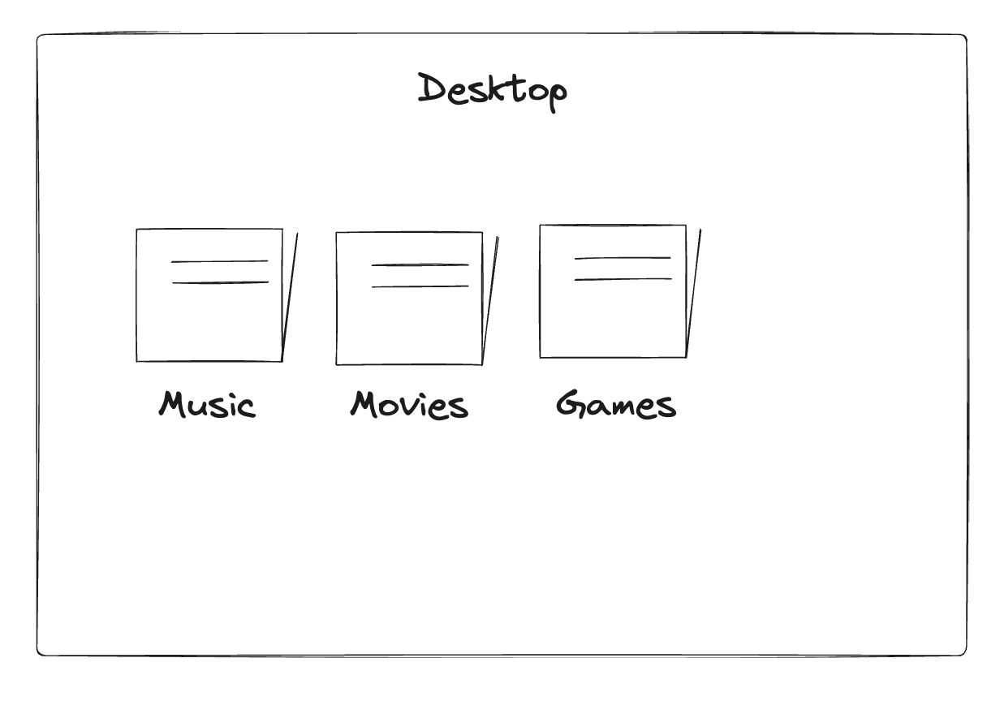

---
Lesson 2 - Collection
---

Previously we have store our NFT in contract, now we will learn how to organizing your Knight NFT into personalized space using new concept called **_Collection_** rather than storing in the contract space.

A collection is an object that can hold multiple NFTs of the same type, much like folders on your desktop organizing photos, music, and movies.



Now let's understand how we can create a collection.

```jsx
// contract code
access(all) contract HelloWorld: NonFungibleToken {

  // This is like a special room inside your contract,
  // but only for NFTs!
  access(all) resource Collection {
  }
}
```

### **Put it to the Test:**

1. Open Flow [Playground](https://play.flow.com/)
2. Create a resource name Collection.
3. Remove the storedKnight dictionary and storeKnight function for now.

### Solution !!

```jsx
// KnightCreator.cdc

// This code defines a contract named KnightCreator.

contract KnightCreator {

    // The total supply of Knights that can be created.
    var totalSupply: UInt64

    // Removed:
    // access(all) let storedKnight: @(UInt64: KnightNFT)

    // Defines a struct to store details about a Knight.
    struct KnightDetails {
        var name: String
        var power: UFix64

        // Initializes a new KnightDetails instance.
        init() {
            self.name = "Night King"
            self.power = 50.0
        }
    }
}
```
