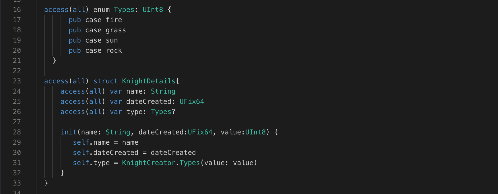
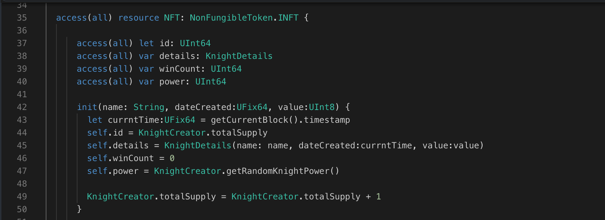

---
Lesson 6 - enum
---

Remember our - `type` variable which needs to pass static value like - fire, water, rock, grass, electric, ice, flying, ghost, dark, steel, dragon, poison, fighting etc.

We've learned how to organize data with structs, but what if a variable can only have specific values? Enums come to the rescue to make it more organize.

#### Enums like Checklists for Your Code

Imagine a coffee shop with three cup sizes: small, medium, and large. An enum acts like a checklist, ensuring your code only uses these valid options. This reduces errors and keeps things organized.

- We use the `enum` keyword to create enums.
- Each option within the enum is called a `case`

```jsx
access(all) contract Cafe {

    access(all) enum CupSize: UInt8 {
        access(all) case small
        access(all) case medium
        access(all) case large
    }
}
```

### Put it to the Test

1. Open Flow [Playground](https://play.flow.com/)
2. Create an enum named `Types` of type `UInt8` and add different type case `fire`, `grass`, `sun`, `rock`, `water`, `ice`, `electric`, `poison`, `dark`.

### Solution !!




---



---


